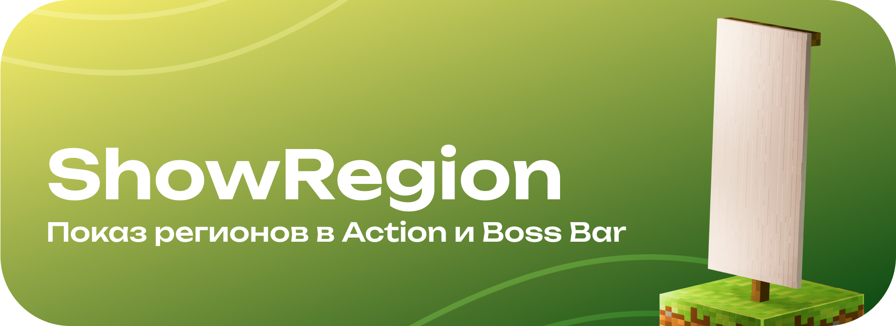

<div align="center">
    
    <h4>Поддерживаемые версии: Paper: 1.18.2 — 1.21.x</h4>
    <h1>Отображение регионов в ActionBar и BossBar</h1>
</div>

<div align="center" content="">
    <a href="https://modrinth.com/plugin/namedchest">
        
    </a>
</div>

### <a href="https://github.com/ilezzov-code/ShowRegion/tree/main"> Select English README.md</a>

##  <a>Оглавление</a>

- [Описание](#about)
- [Особенности](#features)
- [Config.yml](#config)
- [Команды](#commands)
- [Права](#permissions)
- [Ссылки](#links)
- [Поддержать разработчика](#donate)
- [Сообщить об ошибке](https://github.com/ilezzov-code/showregion/issues)


## <a id="about">Описание</a>

**ShowRegion** — это уникальный плагин, который позволит игрокам видет в каком регионе они находятся. Уникальность заключается в том, что для каждого региона можно настроить свое сообщение!

## <a id="features">Особенности</a>

* [🔥] **Кастомные сообщения для определенных регионов** → [подробнее](#custom-messages)
* Поддержка двух языков: ru-RU (Русский), en-US (Английский)
* Отображение свободной территории, чужого и своего региона → [подробнее](#region-show)
* Отображение имени региона и владельцев → [подробнее](#region-name-show)
* Включение / Отключение Action Bar и Boss Bar через команду → [подробнее](#toggle-command)
* Настройка частоты обновления
* Включение / Отключение Action Bar и Boss Bar в config.yml
* Поддержка SQLite, MySQL, PostgreSQL


## <a id="config">Config.yml</a>

<details>
    <summary>Посмотреть config.yml</summary>

```yaml
#  ░██████╗██╗░░██╗░█████╗░░██╗░░░░░░░██╗██████╗░███████╗░██████╗░██╗░█████╗░███╗░░██╗
#  ██╔════╝██║░░██║██╔══██╗░██║░░██╗░░██║██╔══██╗██╔════╝██╔════╝░██║██╔══██╗████╗░██║
#  ╚█████╗░███████║██║░░██║░╚██╗████╗██╔╝██████╔╝█████╗░░██║░░██╗░██║██║░░██║██╔██╗██║
#  ░╚═══██╗██╔══██║██║░░██║░░████╔═████║░██╔══██╗██╔══╝░░██║░░╚██╗██║██║░░██║██║╚████║
#  ██████╔╝██║░░██║╚█████╔╝░░╚██╔╝░╚██╔╝░██║░░██║███████╗╚██████╔╝██║╚█████╔╝██║░╚███║
#  ╚═════╝░╚═╝░░╚═╝░╚════╝░░░░╚═╝░░░╚═╝░░╚═╝░░╚═╝╚══════╝░╚═════╝░╚═╝░╚════╝░╚═╝░░╚══╝

# Developer / Разработчик: ILeZzoV

# Socials / Ссылки:
# • Contact with me / Связаться: https://t.me/ilezovofficial
# • Telegram Channel / Телеграм канал: RUS: https://t.me/ilezzov
# • GitHub: https://github.com/ilezzov-code

# By me coffee / Поддержать разработчика:
# • DA: https://www.donationalerts.com/r/ilezov
# • YooMoney: https://yoomoney.ru/to/4100118180919675
# • Telegram Gift: https://t.me/ilezovofficial
# • TON: UQCInXoHOJAlMpZ-8GIHqv1k0dg2E4pglKAIxOf3ia5xHmKV
# • BTC: 1KCM1QN9TNYRevvQD63UF81oBRSK67vCon
# • Card: 5536914188326494

# Supporting messages languages / Доступные языки сообщений:
# en-US, ru-RU
language: "ru-RU"

# Check the plugin for updates
# Проверять плагин на наличие обновлений
check_updates: true

showing_settings:
  # Should I enable the display of the name of the regions to all new players at the entrance
  # Включить ли отображение имени регионов всем новым игрокам при входе
  default_enable: true
  # Enable Boss Bar
  # Включить Bossbar
  enable_boss_bar: true
  # Enable Action Bar
  # Включить ActionBar
  enable_action_bar: true
  # How many region owners display in placeholder {REGION_NAME}
  # Количество владельцев в плейсхолдере {REGION_OWNER}
  owner_count: 3
  # Tick rate tp update in ticks
  # Частота обновления в тиках
  tick_rate: 1

# Don't edit this / Не редактируйте это
config_version: 1.0
```

</details>

## <a id = "region-show">Отображение свободной территории, чужого и своего региона</a>

Плагин отображает каждый тип регионов: Свободный регион, Ваш регион, Чужой регион. Все сообщения настраиваются в файле [`region_settings.yml`](src/main/resources/region_settings.yml)

Примеры:


## <a id = "region-name-show">Отображение имени региона и владельцев</a>

Плагин поддерживает собственные плейсхолдеры, которые Вы можете добавить в каждое сообщение

* {REGION_NAME} — Название региона
* {REGION_OWNER} — Имя владельца региона

А вот как это будет выглядеть:


## <a id = "custom-messages">[🔥] Кастомные сообщения для определенных регионов</a>

Вы можете настроить кастомные сообщения для определенных регионов в файле [`region_settings.yml`](src/main/resources/region_settings.yml)

Пример: 

<details>

<summary>region_settings.yml</summary>

```yml
# Custom regions list
# Список кастомных регионов
custom_regions:
  # Region name (in WorldGuard)
  # Название региона (в WorldGuard)
  spawn:
    # Message for Action Bar
    # Сообщение для Action Bar
    action_bar: "&7Вы находитесь на &6спавне"
    # Boss Bar settings
    # Настройка BossBar
    boss_bar:
      # Displaying text
      # Отображаемый текст
      text: "&7Вы находитесь на &6спавне"
      # Progress [0.0 ; 1.0]
      # Прогресс [0.0 ; 1.0]
      progress: 1.0
      # Boss Bar color. Supporting colors:
      # Цвет полоски. Доступные цвета:
      # PINK, BLUE, RED, GREEN, YELLOW, PURPLE, WHITE
      color: YELLOW
      # Overlay. Supporting overlays:
      # Оверлей. Доступные оверлеи
      # PROGRESS, NOTCHED_6, NOTCHED_10, NOTCHED_12, NOTCHED_20
      overlay: PROGRESS

  pvp_arena:
    action_bar: "&7Вы находитесь на &cPVP-арене"
    boss_bar:
      text: "&7Вы находитесь на &cPVP-арене"
      progress: 1.0
      color: RED
      overlay: PROGRESS
```
</details>

Результат: 


## <a id = "toggle-command">Включение / Отключение Action Bar и Boss Bar через команду</a>

Каждый игрок может настроить отображение регионов индивидуально для себя: Включить / Отключить Action Bar или Boss Bar

Включение / Отключение всех элементов (команда `/sr toggle`)


Включение / Отключение Action Bar (команда `/sr toggle actionbar`)


Включение / Отключение Boss Bar (команда `/sr toggle bossbar`)


## <a id="commands">Команды (/команда → /псевдоним1, /псевдоним2, ... ※ `право`)</a>

### /showregion reload → /sr reload ※ `showregion.reload`

* Перезагрузить конфигурацию плагина

### /showregion version → /sr version ※ ``

* Проверить наличие обновлений

### /showregion toggle → /sr toggle ※ `showregion.toggle`

* Включить / Отключить Boss Bar и Action Bar

### /showregion toggle actionbar → /sr toggle actionbar ※ `showregion.toggle.actionbar`

* Включить / Отключить Action Bar

### /showregion toggle bossbar → /sr toggle bossbar ※ `showregion.toggle.bossbar`

* Включить / Отключить Boss Bar

## <a id="permissions">Все права плагина</a>

| Право                       | Описание                                    |
|-----------------------------|---------------------------------------------|
| showregion.*                | Доступ ко всем возможностям плагина         |
| showregion.reload           | Доступ к перезагрузке плагина /sr reload    |
| showregion.access.showing   | Доступ к отображению регионов               |
| showregion.toggle           | Доступ к команде /sr toggle                 |
| showregion.toggle.actionbar | Доступ к команде /sr toggle actionbar       |
| showregion.toggle.bossbar   | Доступ к команде /sr toggle bossbar         |
| showregion.toggle.*         | Доступ к команде /sr toggle и ее аргументам |


## <a id="links">Ссылки</a>

* Связаться: https://t.me/ilezovofficial
* Telegram Channel: https://t.me/ilezzov
* Modrinth: https://modrinth.com/plugin/showregion

## <a id="donate">Поддержать разработчика</a>

* DA: https://www.donationalerts.com/r/ilezov
* YooMoney: https://yoomoney.ru/to/4100118180919675
* Telegram Gift: https://t.me/ilezovofficial
* TON: UQCInXoHOJAlMpZ-8GIHqv1k0dg2E4pglKAIxOf3ia5xHmKV
* BTC: 1KCM1QN9TNYRevvQD63UF81oBRSK67vCon
* Card: 5536914188326494

## Found an issue or have a question? Create a new issue — https://github.com/ilezzov-code/ShowRegion/issues/new

## <a id="license">Лицензия</a>

Этот проект распространяется под лицензией `GPL-3.0 License`. Подробнее см. в файле [LICENSE](LICENSE).
